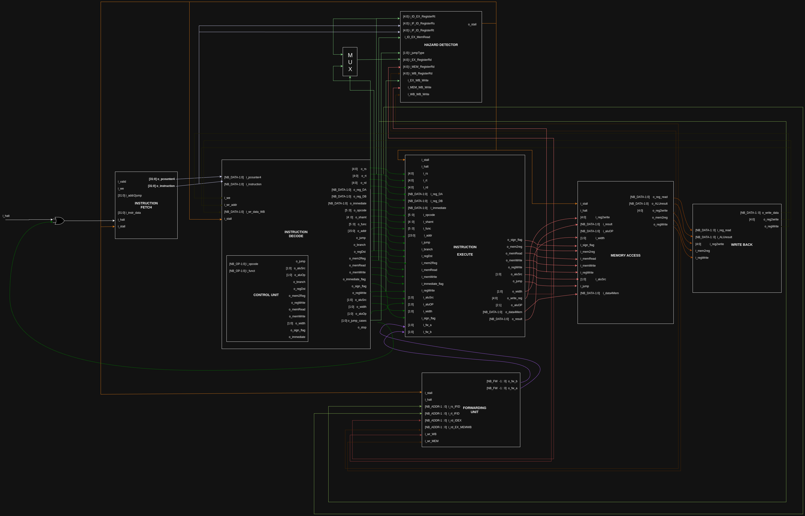
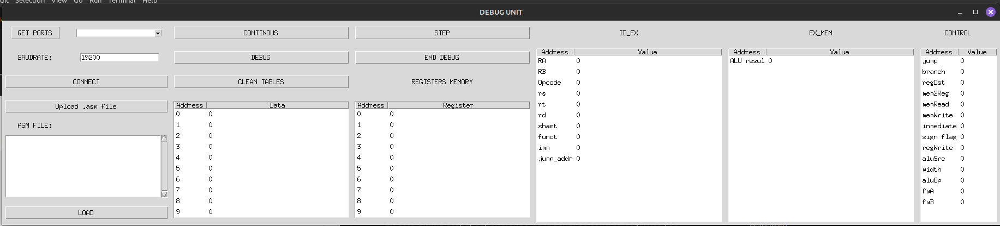

# tp3_MIPS
En este trabajo práctico, implementamos el pipeline de un procesador MIPS basado en el siguiente diagrama diseñado específicamente para este propósito:  
  

A continuación, describiremos en detalle cada etapa del pipeline y su interacción con la interfaz.

# Pipeline

## instruction fetch

En esta etapa interactúan los módulos:
- program counter
- instructio_fetch
- xilinx_one_port_ram_async

La idea intuitiva de esta etapa es buscar instrucciones en la memoria de instrucciones y enviarlas al resto del pipeline.

## Instruction Decode

En esta etapa se decodifican las instrucciones, y se generan las respectivas señales de control para cada caso. En una primera instancia esta etapa solo generaba señales de control, pero a medida que se fue desarrollando el pipeline se tuvieron que agregar nuevas funciones. 
### Saltos
En la etapa instruction decode se realiza el manejo de saltos, en caso de que el salto sea inmediato, o la condición de salto se cumpla, se actualizan las señales "_o_jump, o_jump_cases y o_addr2jump_". La señal jump_cases cambia de estado y se utilizará luego para generar los stall necesarios en la hazard_detection_unit.
El calculo de la dirección de saltos varía en los distintos escenarios.
- JR o JALR: 
    - addr2jump= dato A
- BEQ o BNE
    - addr2jump = i_pcounter4 + (w_immediat << 2) + 4
- JAL o J
    - addr2jump = {i_pcounter4[NB_DATA-1:NB_DATA-4], i_instruction[25:0], 2'b00}

Es importante tener en cuenta que, a la hora de la ejecución de un programa en nuestro pipeline, siempre que se tenga una instrucción de salto se deberá agregar una instrucción "NOP" seguida de la misma. Esto se debe a que en el caso contrario va a ejecutar la instrucción de salto, y la etapa instruction_fetch va a enviar la siguiente instrucción antes de actualizar el program counter con la nueva dirección, generando que se ejecute una instrucción más antes de saltar.
Luego nos dimos cuenta que esto pudo haber sido arreglado generando un control de saltos en la etapa instruction_fetch y así evitando tener que utilizar una instrucción NOP después de cada salto.

### Escritura
En la etapa instruction_decode se realiza también, la escritura de nuvos valores en la memoria de registros. Estos valores provienen de la etapa write_back.

## Instruction Execute

En esta etapa se ejecutan las instrucciones realizando operaciones en la ALU y teniendo en cuenta las señales que provienen de la etapa instruction_decode.
Esta etapa se compone de tres multiplexores que interactúan tanto con las señales que provienen de las otras etapas, como con la unidad de cortocircuitos "forwarding_unit".

Los dos primeros multiplexores tienen en cuenta el estado de la unidad de cortocircuitos para determinar el valor los datos A y B. También teniendo en cuenta que en las operaciones tipo JAL y JARL no se realiza un cortocircuitos. 
En el caso especial del dato B, para cuando se tiene una operación "tipo inmediata" se da: dato B = valor inmediato.

El tercer multiplexor determina la dirección que se va a escribir en la etapa write_back. Cuando la entrada _"i_regDst"_ proveniente de la etapa anterior esté seteada en 1, la dirección a escribirse será la guardada en el registro rt, caso contrarió será la especificada por el valor de rd.

## memory access
En esta etapa se escriben o leen los datos en la memoria de datos dependiendo de la señal de control _"memWrite"_. La memoria puede almacenar hasta 32 datos de 32 bits que se almacenan en bloques de 8 bits. 

Tambien, dependiendo de la señal de control _"i_width"_ se enmascara el valor del registro en 8, 16 o 32 bits. 

Por ultimo, se realiza una extension de signo dependiendo de la señal de control _"sign_flag"_.

## write back
En esta última etapa, dependiendo de la señal de control _"regWrite"_, se determina si se va a escribir o no en la etapa _instruction decode_ en la memoria de registros. Dependiendo de la señal de control _"mem2reg"_ se escribe el resultado de la ALU o el dato laido en la etapa anterior _memory access_.

# Interfaz
Reutilizando los módulos _uart_rx_ y _uart_tx_ del trabajo practico 2 realizamos la siguiete interfaz para facilitar la utilizacion del MIPS:

### Sección Izquierda

1. **Selección de Puertos**  
   - En la parte superior, se enumeran los puertos disponibles, permitiendo la conexión con la placa.

2. **Carga de Archivo .asm**  
   - En la parte inferior, se carga el archivo `.asm` que contiene las instrucciones del programa.  
   - Estas instrucciones son convertidas a binario por un compilador desarrollado en Python.  

3. **Envío de Instrucciones**  
   - Al hacer clic en el botón **_LOAD_**, las instrucciones se envían a la placa a través de UART.  
   - Esto permite cambiar dinámicamente el conjunto de instrucciones tantas veces como sea necesario, siempre que sean compatibles con el compilador.  

#### Instrucciones Compatibles

El compilador soporta las siguientes instrucciones para este trabajo práctico:

- **Instrucciones R-Type:**  
  - `SLL`, `SRL`, `SRA`, `SLLV`, `SRLV`, `SRAV`,  
  - `ADDU`, `SUBU`, `AND`, `OR`, `XOR`, `NOR`,  
  - `SLT`, `SLTU`.

- **Instrucciones I-Type:**  
  - Carga y almacenamiento: `LB`, `LH`, `LW`, `LWU`, `LBU`, `LHU`, `SB`, `SH`, `SW`.  
  - Aritmética y lógica: `ADDI`, `ADDIU`, `ANDI`, `ORI`, `XORI`, `LUI`, `SLTI`, `SLTIU`.  
  - Condicionales: `BEQ`, `BNE`.  
  - Saltos: `J`, `JAL`.

- **Instrucciones J-Type:**  
  - `JR`, `JALR`.  

Este diseño asegura flexibilidad y control para cargar y ejecutar instrucciones en la placa de manera dinámica.

### Modos de Ejecución del Pipeline

El pipeline puede operar en dos modos: **continuo** o **debug**. Antes de describir cada modo, es fundamental entender cómo se transmiten los datos a través de UART.

#### Transmisión de Datos por UART
En cada ciclo de reloj, muchas de las señales internas del pipeline también se envían como salidas hacia el módulo _top_ que se conecta con el módulo _uart_interface_. Estas señales son visibles en nuestra interfaz y se componen de:
- Señales de control.
- Señales de los latches.
- Datos escritos en ambas memorias, incluyendo su dirección y el flag de escritura.

#### Modos de Operación

1. **Modo Continuo**  
   En este modo, el pipeline ejecuta todas las instrucciones de forma continua. Al finalizar, se transmiten las señales previamente mencionadas. Sin embargo, debido a esta forma de operación, en la interfaz solo se visualizan los datos escritos en las memorias durante el último ciclo ejecutado.

2. **Modo Debug**  
   En este modo, el pipeline avanza paso a paso mediante la señal _STEP_. Después de cada paso de ejecución, se envían las mismas señales descritas anteriormente. Esto permite observar en la interfaz cómo cambian las señales de control, las señales de los latches y los datos escritos en las memorias a lo largo de cada ciclo.

Este esquema garantiza flexibilidad para depurar y analizar el comportamiento del pipeline según las necesidades del usuario.

