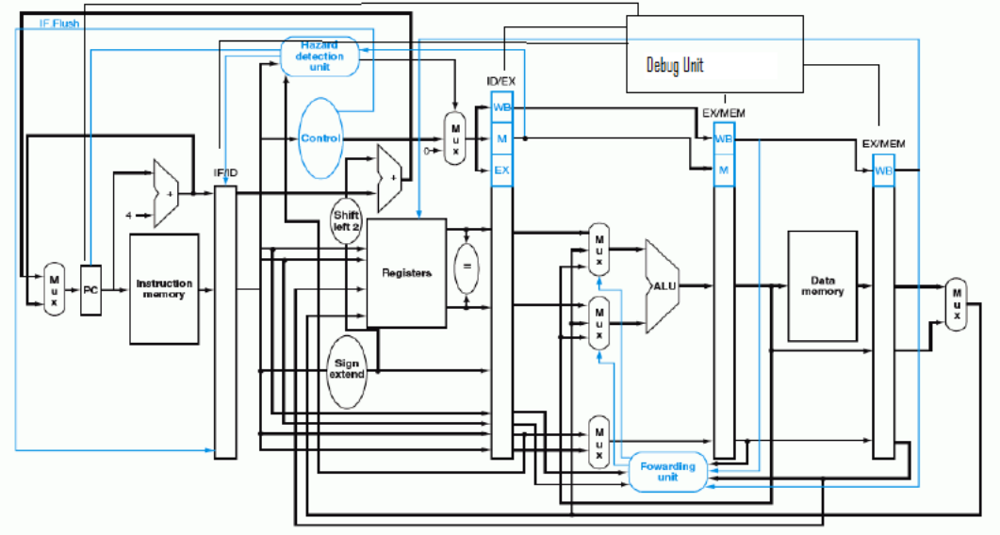
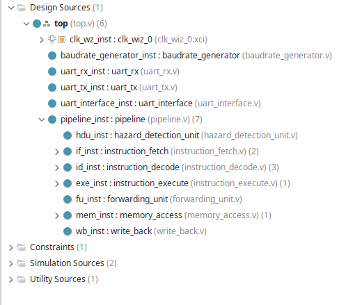
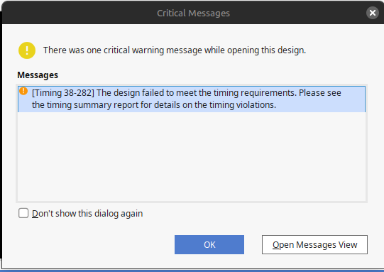
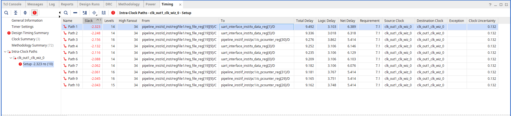

Este proyecto fue realizado por los alumnos: 
- [Mansilla, Josías Leonel](https://github.com/w3rqil)
    - leonel.mansilla@mi.unc.edu.ar
- [Schroder Ferrando, Florencia](https://github.com/FlorSchroder) 
    - florencia.schroder@mi.unc.edu.ar

# Consigna
En este proyecto se pide implementar  el pipeline del procesador MIPS. 
A continuación un diagrama intuitivo del pipeline a implementar:

# Desarrollo

En este trabajo práctico, teniendo en cuenta la consigna y la bibliografía recomendada _"Computer Organization and Design 3rd Edition.
Chapter 6. Hennessy- Patterson"_, se implementó el pipeline de un procesador MIPS basado en el siguiente diagrama diseñado específicamente para este propósito:  
  

A continuación, describiremos en detalle cada etapa del pipeline y su interacción con la interfaz.

# Pipeline
## Jerarquía de archivos

## instruction fetch

En esta etapa interactúan los módulos:
- program counter
- instruction_fetch
- xilinx_one_port_ram_async

La idea intuitiva de esta etapa es buscar instrucciones en la memoria de instrucciones y enviarlas al resto del pipeline.

## Instruction Decode

En esta etapa se decodifican las instrucciones, y se generan las respectivas señales de control para cada caso. En una primera instancia esta etapa solo generaba señales de control, pero a medida que se fue desarrollando el pipeline se tuvieron que agregar nuevas funciones. 

### Control Unit
La unidad de control recibe el opcode y la función de la instrucción para identificar que tipo deinstrucción es y en base a esto modificar las señales de control que van a generar distintos estados en las siguientes etapas del pipeline.

### Saltos
En la etapa instruction decode se realiza el manejo de saltos, en caso de que el salto sea inmediato, o la condición de salto se cumpla, se actualizan las señales "_o_jump, o_jump_cases y o_addr2jump_". La señal jump_cases cambia de estado y se utilizará luego para generar los stall necesarios en la hazard_detection_unit.
El calculo de la dirección de saltos varía en los distintos escenarios.
- JR o JALR: 
    - addr2jump= dato A
- BEQ o BNE
    - addr2jump = i_pcounter4 + (w_immediat << 2) + 4
- JAL o J
    - addr2jump = {i_pcounter4[NB_DATA-1:NB_DATA-4], i_instruction[25:0], 2'b00}

Es importante tener en cuenta que, a la hora de la ejecución de un programa en nuestro pipeline, siempre que se tenga una instrucción de salto se deberá agregar una instrucción "NOP" seguida de la misma. Esto se debe a que en el caso contrario va a ejecutar la instrucción de salto, y la etapa instruction_fetch va a enviar la siguiente instrucción antes de actualizar el program counter con la nueva dirección, generando que se ejecute una instrucción más antes de saltar.
Luego nos dimos cuenta que esto pudo haber sido arreglado generando un control de saltos en la etapa instruction_fetch y así evitando tener que utilizar una instrucción NOP después de cada salto.

### Escritura
En la etapa instruction_decode se realiza también, la escritura de nuvos valores en la memoria de registros. Estos valores provienen de la etapa write_back.

## Instruction Execute

En esta etapa se ejecutan las instrucciones realizando operaciones en la ALU y teniendo en cuenta las señales que provienen de la etapa instruction_decode.
Esta etapa se compone de tres multiplexores que interactúan tanto con las señales que provienen de las otras etapas, como con la unidad de cortocircuitos "forwarding_unit".

Los dos primeros multiplexores tienen en cuenta el estado de la unidad de cortocircuitos para determinar el valor los datos A y B. También teniendo en cuenta que en las operaciones tipo JAL y JARL no se realiza un cortocircuitos. 
En el caso especial del dato B, para cuando se tiene una operación "tipo inmediata" se da: dato B = valor inmediato.

El tercer multiplexor determina la dirección que se va a escribir en la etapa write_back. Cuando la entrada _"i_regDst"_ proveniente de la etapa anterior esté seteada en 1, la dirección a escribirse será la guardada en el registro rt, caso contrarió será la especificada por el valor de rd.

## memory access
En esta etapa se escriben o leen los datos en la memoria de datos dependiendo de la señal de control _"memWrite"_. La memoria puede almacenar hasta 32 datos de 32 bits que se almacenan en bloques de 8 bits. 

Tambien, dependiendo de la señal de control _"i_width"_ se enmascara el valor del registro en 8, 16 o 32 bits. 

Por ultimo, se realiza una extension de signo dependiendo de la señal de control _"sign_flag"_.

## Write Back

En esta última etapa del pipeline, se decide si se realizará una escritura en la memoria de registros de la etapa _Instruction Decode_, dependiendo de la señal de control **_regWrite_**.  

Si **_regWrite_** está activa, se habilita la escritura en la memoria de registros. 
 
Según el valor de la señal de control **_mem2reg_**, se determina el origen del dato a escribir:  
- Si **_mem2reg_** está activa, se escribe el dato leído en la etapa previa (_Memory Access_).  
- Si no está activa, se escribe el resultado generado por la ALU.  

Esta etapa asegura que los datos correctos sean almacenados en los registros según el flujo de control establecido.

## Hazard Detection Unit

La unidad de detección de riesgos, o "hazard_detection_unit", es la unidad encargada de generar los "stall" o burbujas en el pipeline en caso de que haya un riesgo, ya sea de datos o de control.
- Data Hazards: Cuando una instrucción depende de datos que aún no están disponibles porque están siendo calculados o cargados.
- Control Hazards: Cuando el flujo de control depende de resultados que aún no están listos, como en instrucciones de salto o ramas condicionales.

Estos riesgos se dan cuando una instrucción intenta utilizar el valor de un registro que todavía no ha sido escrito en memoria, y para ello se utilizan los valores 'rs', 'rd' y 'rt' de las distintas etapas del pipeline. 

En caso de detectar un riesgo, el módulo genera una señal de 'stall' que va a "parar" parte del pipeline. Esta señal de stall hace parar el program counter, y por lo tanto la lectura de instrucciones en la etapa IF, y también las salidas de control de la etapa ID. Esto permite que se sigan ejecutando el resto de etapas y se pueda completar la escritura o lectura de los datos necesarios para ejecutar la instrucción actual.

# Interfaz
Reutilizando los módulos _uart_rx_ y _uart_tx_ del trabajo practico 2 realizamos la siguiete interfaz para facilitar la utilizacion del MIPS:

### Sección Izquierda

1. **Selección de Puertos**  
   - En la parte superior, se enumeran los puertos disponibles, permitiendo la conexión con la placa.

2. **Carga de Archivo .asm**  
   - En la parte inferior, se carga el archivo `.asm` que contiene las instrucciones del programa.  
   - Estas instrucciones son convertidas a binario por un compilador desarrollado en Python.  

3. **Envío de Instrucciones**  
   - Al hacer clic en el botón **_LOAD_**, las instrucciones se envían a la placa a través de UART.  
   - Esto permite cambiar dinámicamente el conjunto de instrucciones tantas veces como sea necesario, siempre que sean compatibles con el compilador.  

#### Instrucciones Compatibles

El compilador soporta las siguientes instrucciones para este trabajo práctico:

- **Instrucciones R-Type:**  
  - `SLL`, `SRL`, `SRA`, `SLLV`, `SRLV`, `SRAV`,  
  - `ADDU`, `SUBU`, `AND`, `OR`, `XOR`, `NOR`,  
  - `SLT`, `SLTU`.

- **Instrucciones I-Type:**  
  - Carga y almacenamiento: `LB`, `LH`, `LW`, `LWU`, `LBU`, `LHU`, `SB`, `SH`, `SW`.  
  - Aritmética y lógica: `ADDI`, `ADDIU`, `ANDI`, `ORI`, `XORI`, `LUI`, `SLTI`, `SLTIU`.  
  - Condicionales: `BEQ`, `BNE`.  
  - Saltos: `J`, `JAL`.

- **Instrucciones J-Type:**  
  - `JR`, `JALR`.  

Este diseño asegura flexibilidad y control para cargar y ejecutar instrucciones en la placa de manera dinámica.

### Modos de Ejecución del Pipeline

El pipeline puede operar en dos modos: **continuo** o **debug**. Antes de describir cada modo, es fundamental entender cómo se transmiten los datos a través de UART.

#### Transmisión de Datos por UART
En cada ciclo de reloj, muchas de las señales internas del pipeline también se envían como salidas hacia el módulo _top_ que se conecta con el módulo _uart_interface_. Estas señales son visibles en nuestra interfaz y se componen de:
- Señales de control.
- Señales de los latches.
- Datos escritos en ambas memorias, incluyendo su dirección y el flag de escritura.

#### Modos de Operación

1. **Modo Continuo**  
   En este modo, el pipeline ejecuta todas las instrucciones de forma continua. Al finalizar, se transmiten las señales previamente mencionadas. Sin embargo, debido a esta forma de operación, en la interfaz solo se visualizan los datos escritos en las memorias durante el último ciclo ejecutado.

2. **Modo Debug**  
   En este modo, el pipeline avanza paso a paso mediante la señal _STEP_. Después de cada paso de ejecución, se envían las mismas señales descritas anteriormente. Esto permite observar en la interfaz cómo cambian las señales de control, las señales de los latches y los datos escritos en las memorias a lo largo de cada ciclo.

Este esquema garantiza flexibilidad para depurar y analizar el comportamiento del pipeline según las necesidades del usuario.

# Timing Analyses

Para determinar la frecuencia del clock se realizaron pruebas con distintas frecuencias. 
Esta frecuencia se ve limitada debido al camino crítico del proyecto. El camino crítico es el camino más largo en un circuito. Este camino se puede medir entre entradas y salidas, o entre registros, es por ello que una forma de achicarlo es agregando registros.

A continuación se probó con una frecuencia de 70 [MHz].
Se puede observar un critical warning referido al timing.

Y los distintos paths, incluyendo el "más crítico" (el path que tiene slack más negativo, Path 1):

Estos errores se vieron solucionados utilizando un clock de 45 [MHz], con el que pudimos llevar a cabo la implementación.

_*Nota: Para visualizar una mejor documentación del proyecto se puede utilizar la extensión de vscode "TerosHDL".*_

